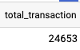

# Sprint1

# Overview about Cool Cat Transactions

### Find Cool Cat Contract

```sql
select *
FROM `bigquery-public-data.crypto_ethereum.transactions`
where to_address = lower('0x1a92f7381b9f03921564a437210bb9396471050c')
```

**Finding**: I found all cool cat related transactions by setting the contract address of cool cat as to_address.

**Question**: When I set the from_address to cool cat contract address I can only find 1 transaction. Why all transactions related to cool cat are in the to_address. 

### Total Number of Transactions for Cool_cat: all transaction is distinct

```sql
select count(*) total_transaction 
from `bigquery-public-data.crypto_ethereum.transactions` tr
where tr.to_address = lower('0x1a92f7381b9f03921564a437210bb9396471050c')
```



# Overview of Transactions and Token_transfer

### Total Number of Transactions for Cool Cat with Token_transfer

```sql
select count(*) total_transaction_with_token 
FROM `bigquery-public-data.crypto_ethereum.transactions` tr 
join `bigquery-public-data.crypto_ethereum.token_transfers` tk_tr
    on tk_tr.transaction_hash = tr.`hash`
    and tk_tr.block_number = tr.block_number
where tr.to_address = lower('0x1a92f7381b9f03921564a437210bb9396471050c')
```


### T1 Table: use cool cat transactions left join token_transfer

```sql
SELECT tr.`hash` tr_hash, tr.block_number, tr.transaction_index, 
	ifnull(cast(tk_tr.value as FLOAT64), 0) token_transfer, tr.receipt_gas_used,
  tr.receipt_cumulative_gas_used, 
  tk_tr.from_address, tk_tr.to_address, tr.to_address transaction_address
FROM `bigquery-public-data.crypto_ethereum.transactions` tr 
left join `bigquery-public-data.crypto_ethereum.token_transfers` tk_tr
    on tk_tr.transaction_hash = tr.`hash`
    and tk_tr.block_number = tr.block_number
where tr.to_address = lower('0x1a92f7381b9f03921564a437210bb9396471050c')
```

### Total Number of Distinct Transactions for Cool Cat with token_transfer

```sql
select count(distinct tr_hash) total_distinct_transaction_with_token 
FROM t
where token_transfer is not null
```


### Total Number of Distinct Transactions with No Token_transfer

```sql
select count(distinct tr_hash ) transaction_no_token from t 
where token_transfer is null
```


**Finding** 

1. There are transactions have multiple token_transfer
2. There are transactions do not have token_transfer 

**Question**: Why some transactions have multiple token_transfer?

             Can I get the total token_transfer for each transaction by (group by transaction)?

### T2 Table

```sql
select distinct tr_hash distinct_tr, block_number, transaction_index, 
    receipt_gas_used, sum(receipt_gas_used) over(partition by tr_hash) total_gas_used, 
    token_transfer, sum(token_transfer) over(partition by tr_hash) total_token_transfer, 
    receipt_cumulative_gas_used, 
from t

```


**Question:** 

1. Sum(receipt_gas_used) should be same as receipt_gas_used for each transaction, because I think each transaction should only have one receipt_gas_used, but there are some difference.
2. If we have total_token_transfer and total_gas_used for each transaction, should we calculate gas_for_unit_token = total_gas_used/total_token_transfer?

### total_gas_used and total_token_transfer for each transaction

```sql
-- some hash has multiple token-transfer
select distinct tr_hash, sum(receipt_gas_used) total_gas_used, 
	sum(token_transfer) total_token_transfer from t  
group by 1
```


**Finding** 

- I group by tr_hash because there are some transactions have multiple token_transfer.

### T3 Table: Number of tr, avg(total_gas_used), avg(total_token_transfer) in each block,

```sql
select distinct block_number, count(distinct_tr) as num_transaction, 
    avg(total_gas_used) as avg_gas_used_block, 
    avg(total_token_transfer) as avg_token_transfer_block
from t2 
group by 1
```


**Question**: 

1. Is it reasonable to calculate the average gas used and average token transferred in each block as this way?
2. Another potential way to calculate 

average_gas_per_block = receipt_cumulative_gas_used / transaction_index

# Overview of Cool Cat Block

### B1 Table: for each block how many total transactions and total gas

```sql
SELECT block_number, 
	count('hash') num_transactions, 
	sum(receipt_gas_used) total_gas_used
FROM `bigquery-public-data.crypto_ethereum.transactions`
where to_address = lower('0x1a92f7381b9f03921564a437210bb9396471050c')
group by 1
```


### The Number of Blocks in Cool Cat

```sql
select count(distinct block_number) total_block_used_coolcat from t
```


### B2 Table: Max receipt_cumulative_gas_used for each block

```sql
select block_number, max(receipt_cumulative_gas_used) max_cumulative 
from `bigquery-public-data.crypto_ethereum.transactions`
where to_address = lower('0x1a92f7381b9f03921564a437210bb9396471050c')
group by 1
order by 1
```


### Find Proportion of CoolCat Gas Used in Each Block

```sql
select b.block_number, num_transactions, total_gas_used,
    max_cumulative, total_gas_used/max_cumulative proportion 
from b join max_b
    on b.block_number = max_b.block_number
order by 1, proportion
```


# Energy for Each Transaction

```sql
select `hash` transaction_hash, receipt_gas_used, 
	(receipt_gas_used*0.0000036756792144+66.1136)*20/3600 *0.0004 watt_per_tran
FROM `bigquery-public-data.crypto_ethereum.transactions`
where to_address = lower('0x1a92f7381b9f03921564a437210bb9396471050c')
```


# Energy for Each Token


**Should we calculated ?:**

1. gas_for_unit_token = total_gas_used/total_token_transfer
2. formula = Find formula of gas with energy 
3. Use gas_for_unit_token * formula