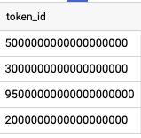

# Sprint 2

# Check for token_id Details

### t table: join transactions and token_transfers table

```sql
with t as (
select tk_tr.value token_id, tr.block_timestamp, 
		tk_tr.block_timestamp, receipt_gas_used, 
		(receipt_gas_used*0.0000036756792144+66.1136)*20/3600 *0.0004 watt_per_tran
FROM `bigquery-public-data.crypto_ethereum.transactions` tr 
	join `bigquery-public-data.crypto_ethereum.token_transfers` tk_tr 
    on tr.`hash` = tk_tr.transaction_hash
where tr.to_address = lower('0x1a92f7381b9f03921564a437210bb9396471050c')) 

```

### Strange token_id

```sql
select distinct (token_id) from t  
where length(token_id) >= 5
```



### Total number of transactions with strange token_id

```sql
select count(*) total_tran_with_strange_token from t  
where length(token_id) >= 8
```


### token_id ≤ 5 with hash

```sql
select token_id, transaction_hash, block_timestamp, tr_from, tr_to, 
		tk_tr_from, tk_tr_to, receipt_gas_used, watt_per_tran, 
    dense_rank() over(partition by token_id order by block_timestamp) rn  
from t
where length(token_id) <= 5
order by token_id, transaction_hash
```


# Two Scenario

### 1. Same hash with different token


In this scenario, token was transferred from null address, which means new token was minted. Since it has the same hash and the gas fee was paid in one time. 

I think when we calculate gas for this kind of token we should use:

**receipt_gas_used / number of different token_id within same hash**

### 2. Same token with different hash


In this scenario, the same token has been transferred in different time and result in different receipt_gas_used. The two transactions are independent to each other. 

I think when we calculate gas for this kind of token we should use:

**avg(receipt_gas_used) group by token_id**

### 3. Token transfer to erc20


# Calculate gas for each token

1. aggregate gas resulted from all transactions for each token 

```sql
select distinct token_id, accumulative_gas_fee, 
	(accumulative_gas_fee*0.0000036756792144+66.1136)*20/3600 *0.0004 watt_per_tran
from 
(
select token_id, 
sum(receipt_gas_used) over(partition by token_id) accumulative_gas_fee from t
) t2 
order by 1
```

