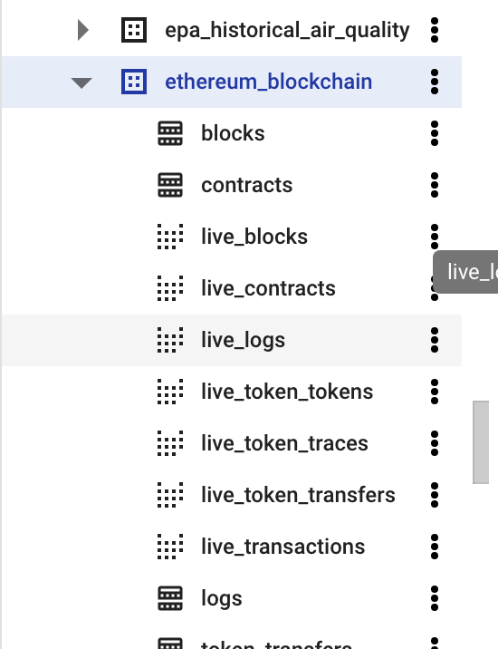

# Transaction & Energy Data Export

## Step 1:

- Find out Ethereum_blockchain for live Ethereum transaction data



- Find out particular smart contract

```solidity
select *
FROM `bigquery-public-data.crypto_ethereum.transactions`
where to_address = lower('0x1a92f7381b9f03921564a437210bb9396471050c')
```

1. Transactions Table —> to_address column = smart contract address 
2. token_transfers Table —> to_address column = smart contract address 
3. When extract transactions related with specific smart contract, using lower() to identify smart contract address. **Without lower(), it can not be identified.**