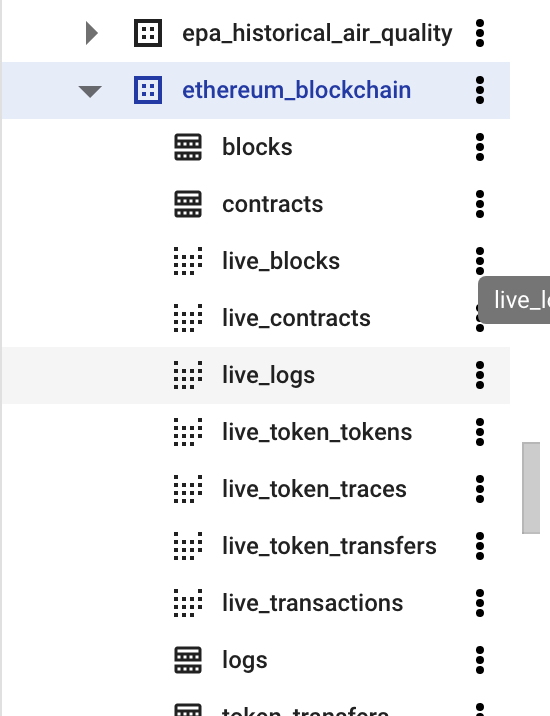

# Transaction & Energy Data Export

# SQL Logic for Energy Calculation

### Step 1: Find out Ethereum_blockchain dataset on BigQuery

- Include live Ethereum transaction data
- Include details about all the tokens, blocks and smart contracts



### Step 2: Use smart contract address to identify particular smart contract

- We mainly use transactions table to find out all transactions related with particular smart contract.
- We use token_transfers table to find out all tokens related with particular smart contract.

```solidity
// smart contract address in transactions table
select *
FROM `bigquery-public-data.crypto_ethereum.transactions`
where to_address = lower('0x1a92f7381b9f03921564a437210bb9396471050c')

// smart contract address in token_transfers table
select *
FROM `bigquery-public-data.crypto_ethereum.token_transfers`
where to_address = lower('0x1a92f7381b9f03921564a437210bb9396471050c')
```

**transactions Table** —> to_address column = smart contract address


**token_transfers Table** —> to_address column = smart contract address


- When extract transactions related with specific smart contract, using lower() to identify smart contract address. **Without lower(), it can not be identified.**

### Step 3: Find out transactions for each token_id in particular smart contract

- Use join function to find out all transactions belong to specific tokens in a smart contra
- Wrote as the temporary table for later calculation

```solidity
with t as (
select tk_tr.value token_id, tr.block_timestamp,
		tk_tr.block_timestamp, receipt_gas_used
FROM `bigquery-public-data.crypto_ethereum.transactions` tr
	join `bigquery-public-data.crypto_ethereum.token_transfers` tk_tr
    on tr.`hash` = tk_tr.transaction_hash
where tr.to_address = lower('0x1a92f7381b9f03921564a437210bb9396471050c'))
```

### Step 4: Calculate total “receipt_gas_used” for each token_id

- Each token_id has multiple transactions
- The total gas used for each token_id should equal to the total number of “receipt_gas_used” belong to the same token_id

```solidity
select token_id,
sum(receipt_gas_used) over(partition by token_id) accumulative_gas_fee from t
) t2
```

### Step 5: Calculate CO2 usage with the researched formula

- Remove duplicates tokens
- Since the formula underestimate the energy consumption, we ignore those potential double gas calculation

```solidity
select distinct token_id, accumulative_gas_fee,
	(accumulative_gas_fee * 0.0000036756792144 + 66.1136) * 1.004 * 0.475 / 0.0005 / 1000 watt_per_token
from
(
select token_id,
sum(receipt_gas_used) over(partition by token_id) accumulative_gas_fee from t
) t2
order by 1
```

# Full Calculation

```solidity
with t as (
select tk_tr.value token_id, tr.block_timestamp,
		tk_tr.block_timestamp, receipt_gas_used
FROM `bigquery-public-data.crypto_ethereum.transactions` tr
	join `bigquery-public-data.crypto_ethereum.token_transfers` tk_tr
    on tr.`hash` = tk_tr.transaction_hash
where tr.to_address = lower('0x1a92f7381b9f03921564a437210bb9396471050c'))

select distinct token_id, accumulative_gas_fee,
	(accumulative_gas_fee * 0.0000036756792144 + 66.1136) * 1.004 * 0.475 / 0.0005 / 1000 watt_per_token
from
(
select token_id,
sum(receipt_gas_used) over(partition by token_id) accumulative_gas_fee from t
) t2
order by 1
```


